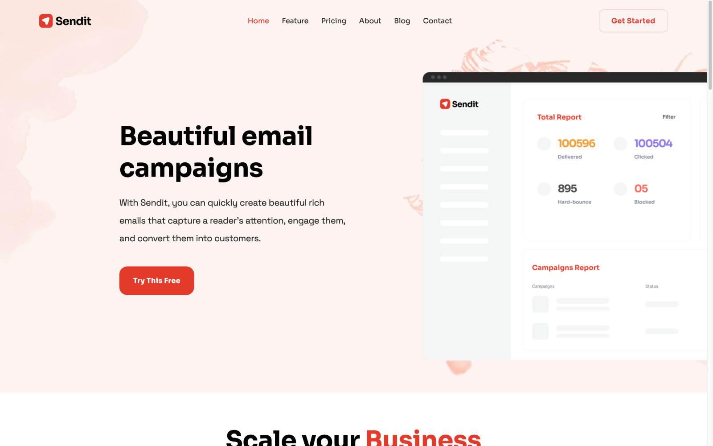

# Sendit

Sendit is a polished, marketing website template for NextJS. Browse through a [live demo](https://mysterious-oryx.cloudvent.net/). 

## Features

* Pre-built pages
* Pre-styled components
* Blog with pagination and category pages
* Configurable navigation and footer
* Multiple hero options 
* Configurable theme colors
* Optimised for editing in [CloudCannon](https://cloudcannon.com/)

## Setup

1. Get a workflow going to see your site's output (with [CloudCannon](https://app.cloudcannon.com/)
or Next.js locally).

## Develop

Sendit is built with [Next.js](https://nextjs.org/) (version `13.0.4`).

~~~bash
$ npm install
$ npm run dev
~~~

## Editing

Sendit is set up for adding, updating and removing pages, components, posts, portfolio items, company details and footer elements in [CloudCannon](https://app.cloudcannon.com/).

### Posts

* Add, update or remove a post in the *Posts* collection.
* The **Staff Author** field links to members in the **Staff** collection.
* Change the defaults when new posts are created in `content/posts/_defaults.md`.

### Company details

* Reused around the site to save multiple editing locations.
* Set in the *Data* / *Company* section.

### Nav/footer details

* Reused around the site to save multiple editing locations.
* Set in the *Data* section with respective names

### Theme colors

* Theme colors can be set in *Data* / *Theme*
* The main colors are set and variants of them are computed
* The colors will update on the next build